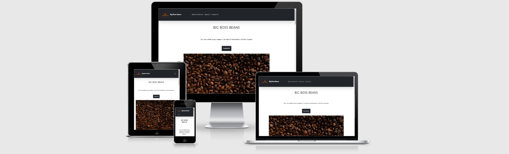

# Big Boss Beans

Big Boss Beans is a site that aims to showcase the amazing new cafe in the heart of Manchester's Northern Quarter. This site is targeted towards younger people looking for somewhere hip and chic to hangout, and do work. Big Boss Beans will be useful for people trying to locate the cafe, learn more about the cafe, and what's on offer within the cafe.

## Features
- Navigation Bar
    * Featured across the entire page, this fully responsive navigation bar, has links to "Where To Find Us?", "About Us" and "Contact Us", this allows for easy navigation across the page.
    *Contains hamburger menu for smaller screens.

- Contact us button
    * The first element on the page is the "Contact Us" button, this benefits users who have a simple and quick question, with an easy way to access the area to ask said question.

- Introduction section
    * A few pictures displaying some of the products and explaining the atmosphere for the cafe, helps in enticing curious customers.

- "Where To Find Us?"
    * The "where to find us" section helps customers in locating the shop quickly, with a embedded google maps screen, they are able to pinpoint where they are in relation to the cafe.

- "About Us?"
    * The "about us" section helps customers find out more about the new and exciting cafe that has just opened up.

- "Contact Us"
    * The "contact us" section, is functional, and allows the user to send messages to the owners that can, with a backend, be used to collect messages and data.

## Features to implement
- Add a reviews page

## Testing

- After rigorous testing, and testing links, and responsiveness. The website works quite well. Especially on Large Mobile Screen and Laptop size.

## Validator Testing
- HTML
    - My HTML was validated using the W3 Validator
-CSS
    - My CSS was validated using the Jigsaw Validator

## Unfixed bugs
- Footer buttons for socials sometimes not displaying correctly.

## Deployment
-The site was deployed to GitHub.io, this was done by renaming the repository, and then the site can be found on Nom115.github.io.

## Content
- The icons in the footer were taken from [Font Awesome](https://fontawesome.com/)

## Media